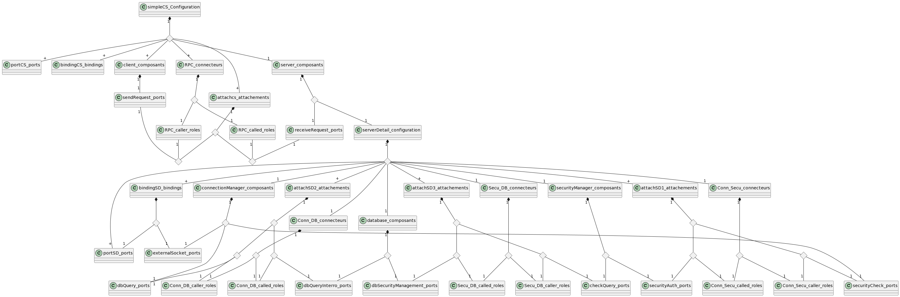

# ASA Project

## REQUIREMENT

You need to have IntelliJ to open the folder ASA in it !

## SPECIFICATION

### M2

### M1

## IMPLEMENTATION

### M2

To see implementation of M2, you can go to this [page](ASA/src/main/java/fr/asa/M2)

### M1

To see implementation of M1, you can go to this [page](ASA/src/main/java/fr/asa/M1)

### M0

To see implementation of M0, you can go to this [page](ASA/src/main/java/fr/asa/M0)

## PRESENTATION

To see our presentation about this project, you can go to these [google slides](https://docs.google.com/presentation/d/1eYR8pEu8qZmSXswkEOXBQ2DUdoDEt0zBA-KT2mq7IzE/edit?usp=sharing)

## REPORT

TODO

## AUTHORS

- Yotlan LE CROM (https://github.com/Yotlan)
- Endy YU (https://github.com/endyappel)
